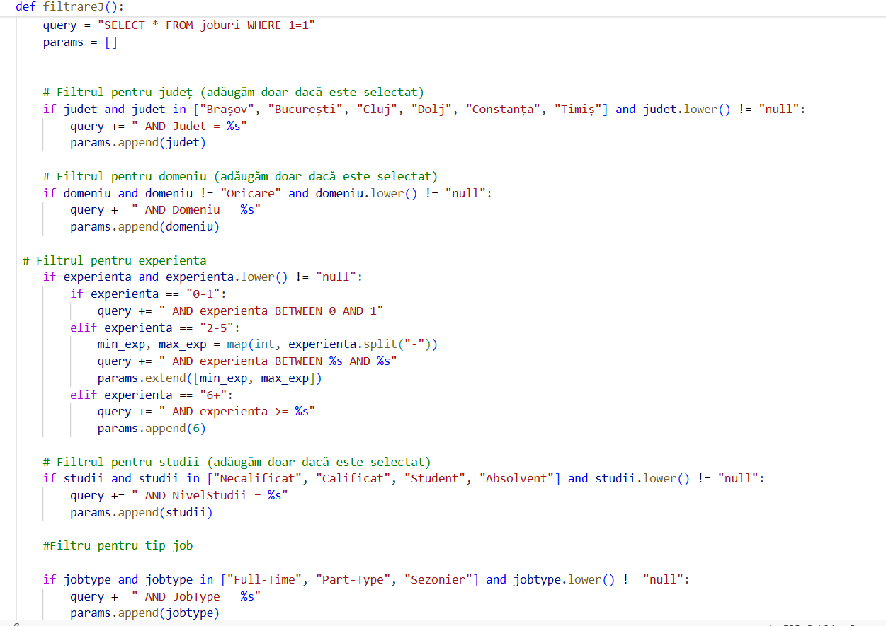
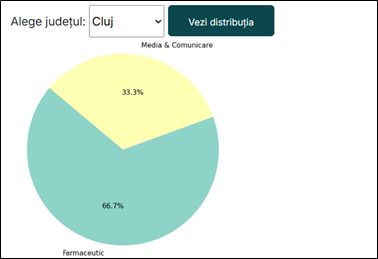
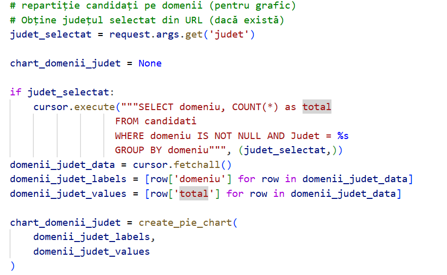

# SQL-Based Data Analysis Applied on Recruitment Platform Project

## Project Overview
This project represents the data analysis component of my final Bachelor Degree project: developing a full-stack recruitment platform.
SQL was used in communicating with the database built in a MariaDB server, through Data Manipulation Language and queries, to support both the operational workflows of the platform and analytical reporting. The relational database stores structured information across multiple tables, including: candidates and employers, jobs details, job applications and views, connected through primary and foreign keys to ensure data integrity.

## SQL Usage & Key Operations

### User Registration and Authentication
- Created and updated user account information
- User authentication and validation by verifying credentials across multiple database tables.
  
### Job Applications & Data Retrieval
- Retrieved detailed job information for employer listings.
- Generated lists of jobs applied to by candidates using multiple `JOIN` operations.*(Images below)*
- Retrieved lists of candidates who applied for specific jobs, accessible to employers.
<table align="center" border="1" cellspacing="0" cellpadding="5">
  <tr>
    <td>
      
    </td>
    <td>
      
    </td>
  </tr>
</table>

### CRUD Operations & Filtering Logic
- Implemented `INSERT`, `UPDATE`, and `DELETE` operations for users, job postings by companies, and applications.
- Ensured data consistency during record creation and updates.
- Built dynamic SQL queries to support filtered and sorted views of candidates, employers, and job postings, allowing up to five simultaneous filters.

---

## Analytical Queries & Insights

Business-oriented analytical queries were developed using complex `JOIN`s, `GROUP BY` clauses, and aggregate functions to transform raw platform data into actionable insights for both candidates and employers.

### Labor Market & Salary Analysis
Several analytical queries were designed to support candidates in understanding labor market dynamics, especially in scenarios such as career reorientation or geographic relocation. These analyses provide visibility into:

- Highest-paying job fields based on average salary levels.
- County-level salary comparisons, highlighting regions with more competitive compensation.

These insights help users evaluate potential opportunities and make informed career decisions based on financial and regional factors.

### Employer & Workforce-Oriented Analysis
To support employers and business stakeholders, additional analyses focus on workforce availability and recruitment dynamics across regions:

- Distribution of candidates by county and field of specialization.
- Regional concentration of skills, useful for companies planning geographic expansion or new operational sites.
  
By leveraging aggregated data on candidate locations and expertise, employers can assess labor availability and align recruitment strategies with regional market conditions.
<table align="center" border="1" cellspacing="0" cellpadding="5">
  <tr>
    <td>
      
    </td>
    <td>
      
    </td>
  </tr>
</table>

